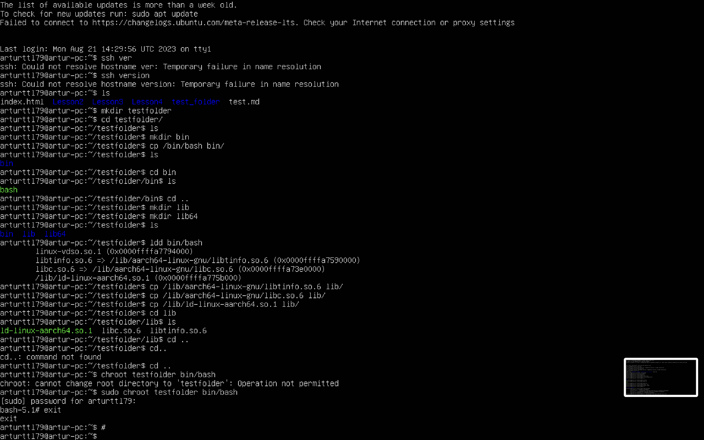
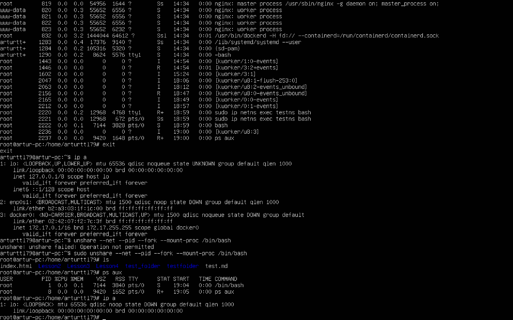

*1*
* Создаем папку testfolder
* Копируем оболочку bash и связанные библиотеки в папку testfolder
* Меняем "корень" для нашей изолированной среды на папку testfolder 

*2*
* Создаем изолированную сеть testns. При этом процессы не изолированы.

*3*
* Создаем изолированную сеть с изолированными процессами от хостовой системы.
