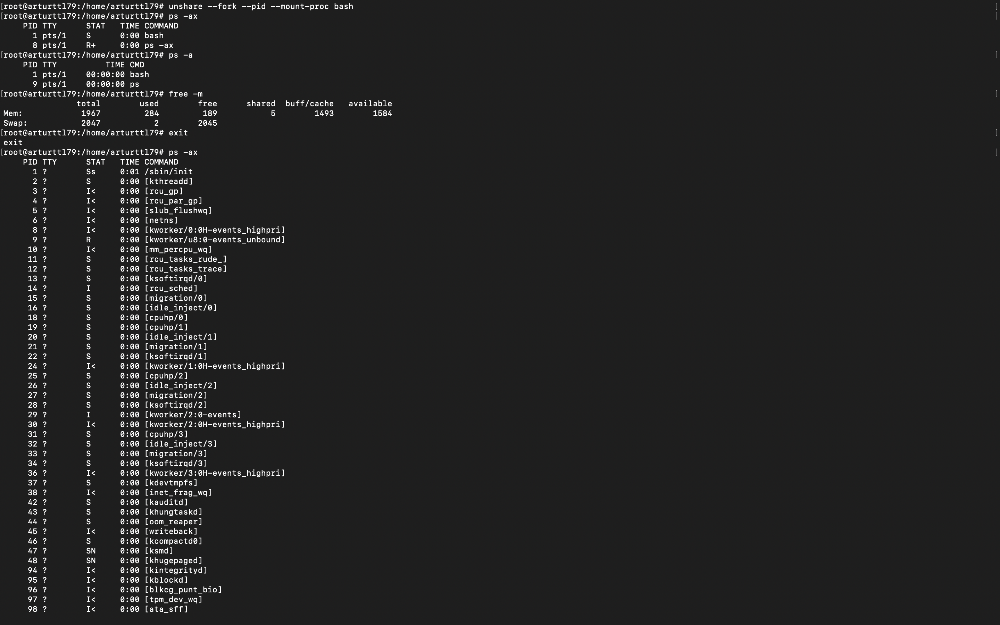
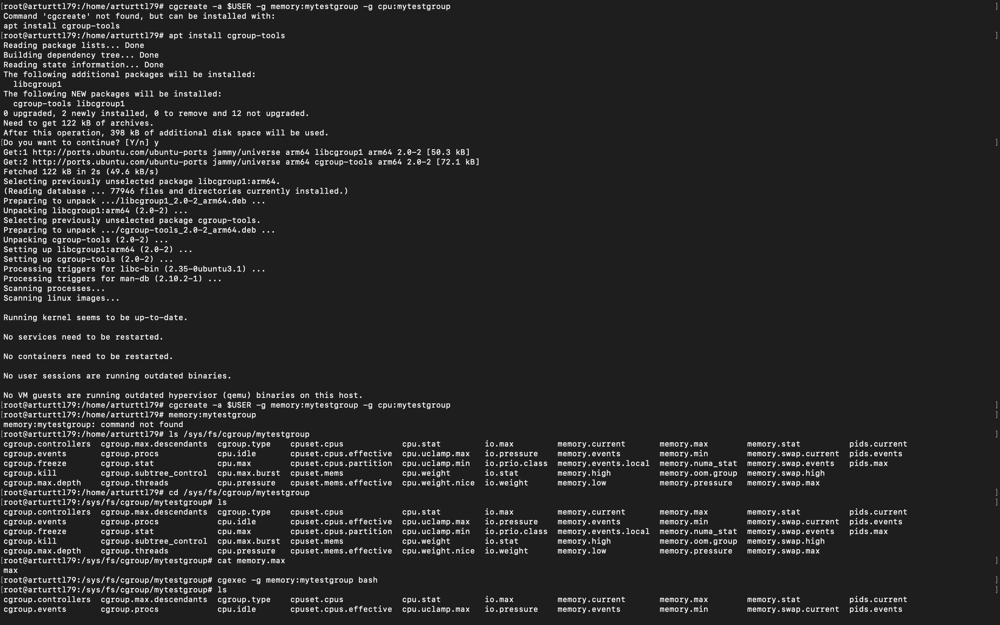
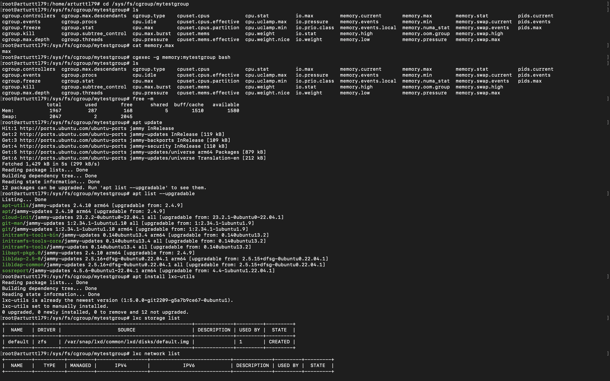
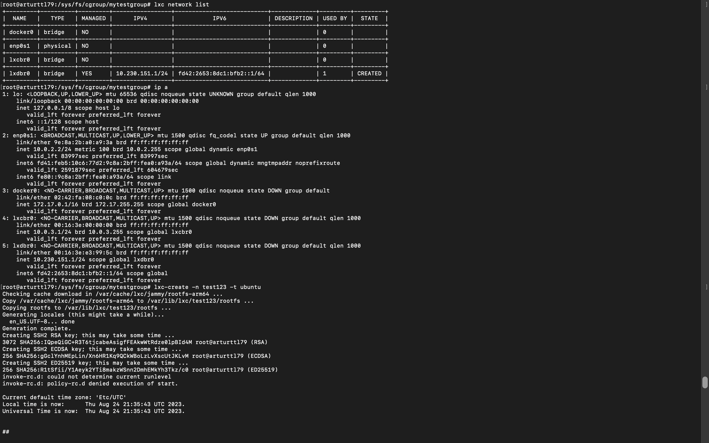
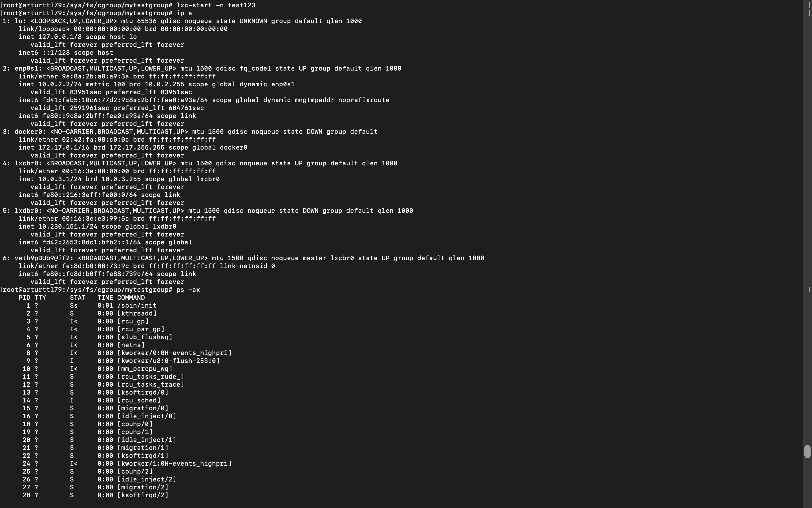
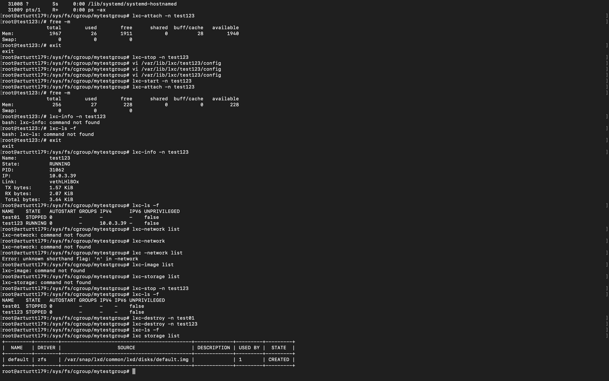

*1*
* Изолируем процесс с помощью команды unshare:

*2*
* Создаем контрольную группу.
* Указываем параметры котоыре будем ограничивать:
- Ограничим memory - memory:mytestgroup
- Ограничим CPU - cpu:mytestgroup
* Войдем в нее.

*3*
* Создаем группу с исходным конфигом.

*4*
* Создаем контейнер с названием test123.

*5*
* Запускаем контейнер с названием test123.

*6*
* Входим в контейнер с названием test123.
* Проверяем память.
* Ограничиваем память до 256 Мб.
* Проверяем память.
