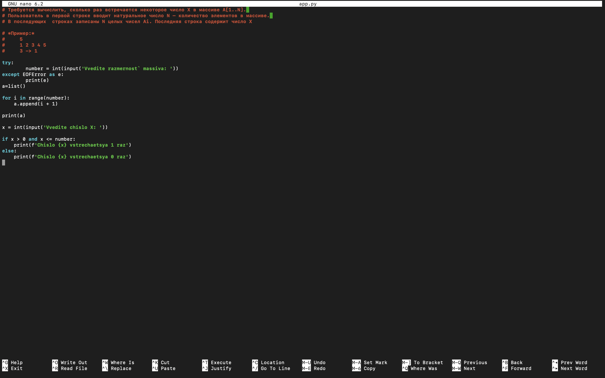
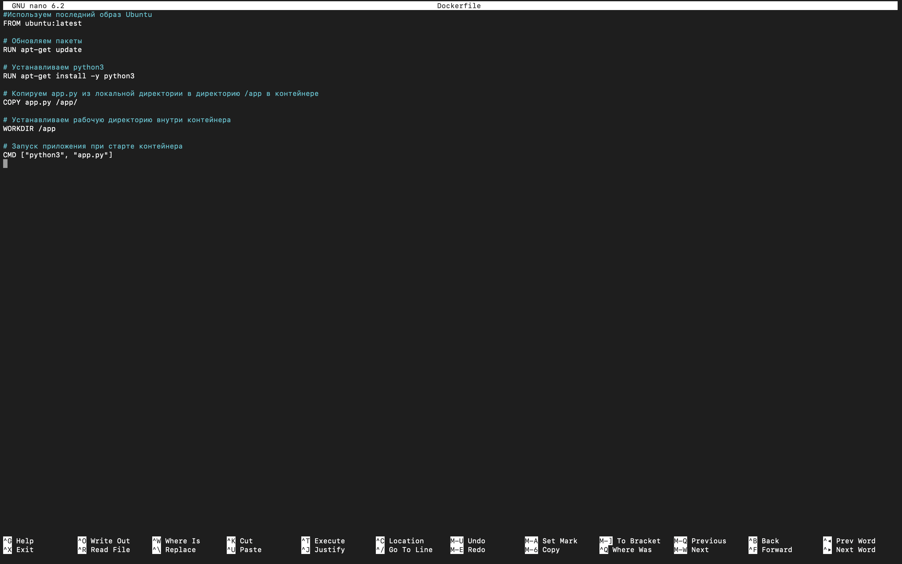
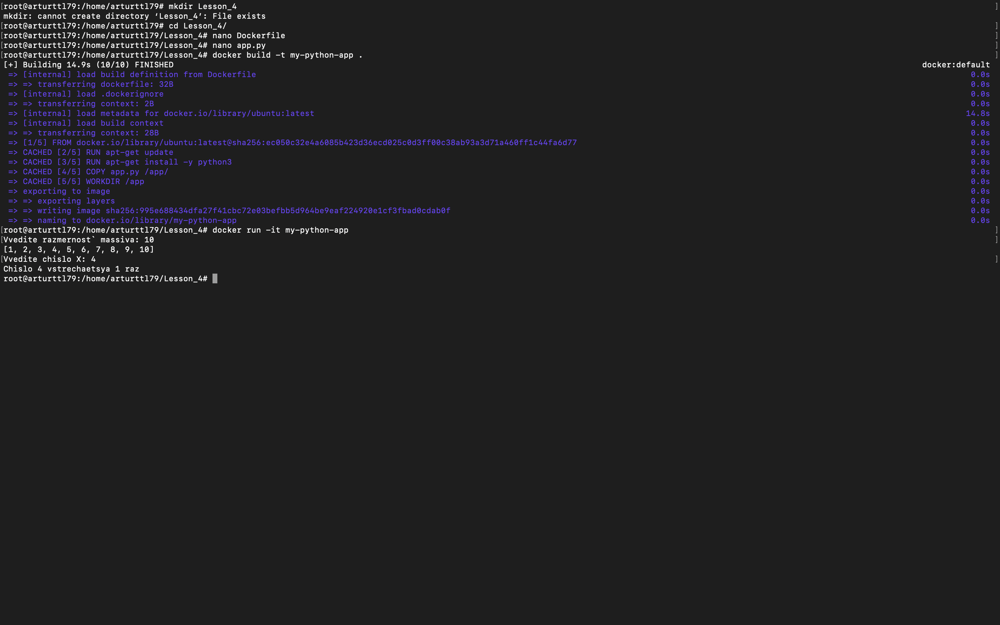

*1*
* Создаем app.py через nano редактор и пишем код на языке Python:

*2*
* Создаем Dockerfile через nano редактор и задаём команды:

*3*
* 'Билдим' и запускаем наш докерфайл в интерактивном режиме.
