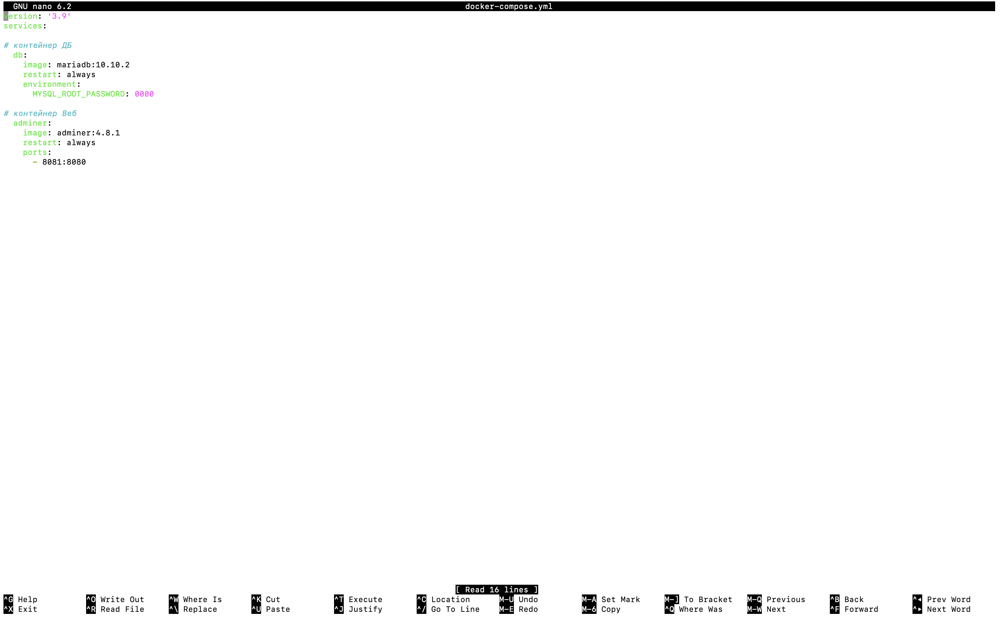
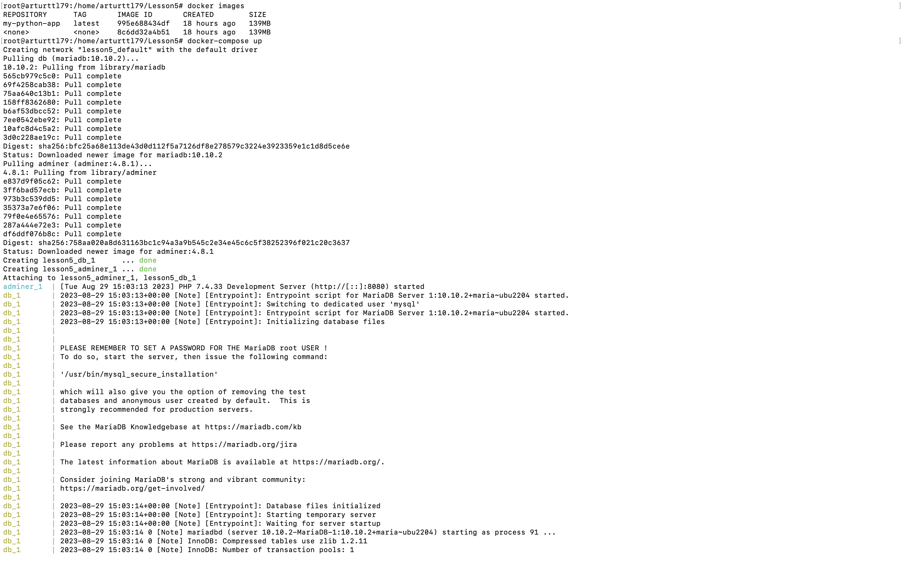
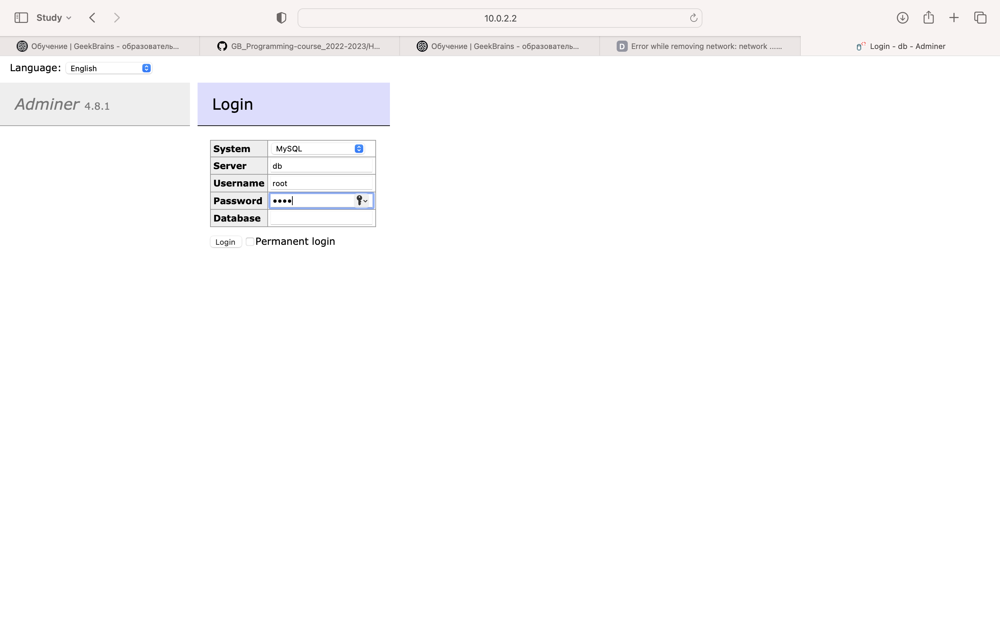

*1*
* Создаем docker-compose.yml файл через nano редактор и пишем контейнеры, которые хотим запустить и связать между собой:

*2*
* Скачиваем docker-compose и запускаем наши контейнеры через docker-compose up команду:

*3*
* Заходим через Веб-интерфейс в localhost:8081 (или по IP адресу через SSH).
